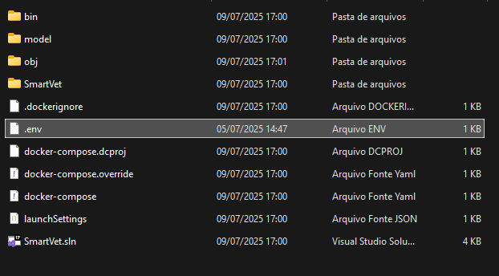
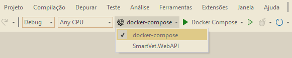
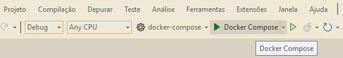
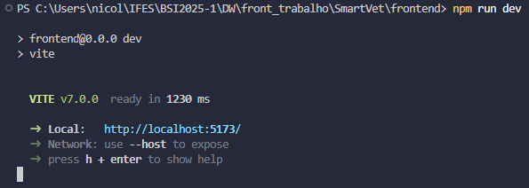

# Trabalho - Desenvolvimento Web

Repositório do trabalho da disciplina de Desenvolvimento Web

---

## Grupo

- Gabriel Dias  
- Guilherme Gomes  
- Manuelly Lemos  
- Nicolas Botelho  
- Vitor Nascimento  

---

## Projeto

### Nome  
**SmartVet**

### Descrição  
**SmartVet** é um sistema para o gerenciamento de uma clínica veterinária, atualmente o sistema permite a adição e modificação dos dados de animais e de atendimentos.

---

## Tecnologias Utilizadas

- **Backend**: C#  
- **Autenticação**: JWT (JSON Web Token)  
- **Frontend**: JavaScript e React  

---

## Como Executar o Projeto

### Pré-requisitos

- Visual Studio 2022  
- Docker  
- Node.js (para o frontend)  
- Git  

### Passos

1. Clone o repositório:  
```bash
git clone https://github.com/gabrieldev131/SmartVet.git
```

#### Backend

2. Abra o Visual Studio 2022 e o Docker Desktop.

3. No Visual Studio 2022, abra a solução `SmartVet.sln`.

4. Copie o arquivo `.env` para a pasta `backend` (esse arquivo possui as informações de conexão com o banco de dados).



5. No Visual Studio, selecione `docker-compose` como item de inicialização.



6. Inicie o projeto.



#### Frontend

7. Navegue até a pasta `frontend` no terminal e execute os comandos:

```bash
npm i        # Instala as dependências
npm run dev  # Inicia o servidor de desenvolvimento
```

8. Abra o link exibido no terminal para acessar o frontend da aplicação.



---

## Entregas

### Entrega 1

Markdown com a documentação do trabalho pode ser encontrado em:
`SmartVet/docs/README.md`

### Entrega 2

Implementação completa com:

* Backend funcional
* Autenticação via JWT
* Frontend integrado

---