# Documentação do Trabalho - Desenvolvimento Web

## PMC do Projeto

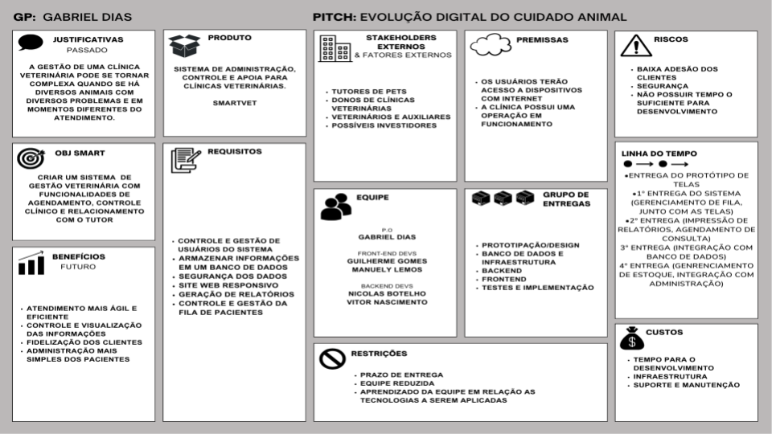

## Visão Geral

Esse projeto visa a criação de um sistema de gestão para clínicas veterinárias

---

## Backlog (Funcionalidades)

| Id | Nome | Descrição | Dependências |
|----|------|-----------|--------------|
| 1  | CRUD de Usuário | Cadastro de Administrador, Recepcionista, Veterinário e Cliente | - |
| 2  | Autenticação | Login de Usuários (com senha) | 1 |
| 3  | Controle de Acesso | Definição de Níveis de Acesso para cada tipo de usuário | 1 |
| 4  | CRUD de Serviços | Cadastro dos Serviços da Clínica | - |
| 5  | CRUD de Animais | Cadastro de Animais | 1 |
| 6  | Agendamento de Consulta | Criação e Agendamento da Consulta | 1, 3 e 4 |
| 7  | Lista de Prioridade de Atendimento | Adição de Animais com Consultas Agendadas na Lista de Prioridade | 1, 3, 4 e 5 |
| 8  | Consulta Veterinária |Registro dos Resultados da Consulta | 1, 3, 4 e 5 |
| 9  | Relatórios | Criação de Relatórios sobre os Animais e Consultas | 1, 2, 3, 4 e 6 |
| 10 | Histórico | Listagem das Consultas de Animais por Cliente e por Veterinário | 1, 2, 3, 4 e 6 |

---

## Descrição das Funcionalidades

### 1 - Crud de Usuário
- Criação de usuário com nome, email, senha e tipo de usuário (Administrador, Recepcionista, Veterinário e Cliente).
- Busca de usuário específico no sistema.
- Atualizar um usuário.
- Deletar um usuário.

### 2 - Autenticação
- Um usuário faz o login no sistema informando o nome e a senha.
- Um usuário só pode ter acesso ao sistema se a senha informada for igual aquela armazenada no sistema.

### 3 - Controle de Acesso
- O que cada usuário pode fazer é definido pelo tipo de usuário.

#### Administrador
| Função         | Permissão | Detalhes |
|----------------|-----------|----------|
| Criar          | Sim       | Administrador, recepcionista, veterinário, cliente, animais e serviços |
| Ler/Pesquisar  | Sim       | Usuários, animais, serviços e lista de prioridade de atendimento |
| Atualizar      | Sim       | O seu próprio cadastro, animais e serviços |
| Deletar        | Sim       | Usuários, animais e serviços |
| Consultas      | Sim       | Agendamento |
| Históricos     | Sim       | Todos do sistema |
| Relatórios     | Sim       | Todos do sistema |

#### Recepcionista
| Função         | Permissão | Detalhes |
|----------------|-----------|----------|
| Criar          | Sim       | Recepcionista, veterinário, cliente, animais e serviços |
| Ler/Pesquisar  | Sim       | Usuários, animais, serviços e lista de prioridade de atendimento |
| Atualizar      | Sim       | O seu próprio cadastro, animais e serviços |
| Deletar        | Não       | - |
| Consultas      | Sim       | Agendamento |
| Históricos     | Sim       | Histórico de consultas |
| Relatórios     | Não       | - |

#### Veterinário
| Função         | Permissão | Detalhes |
|----------------|-----------|----------|
| Criar          | Não       | - |
| Ler/Pesquisar  | Sim       | Animais e serviços |
| Atualizar      | Sim       | O seu próprio cadastro |
| Deletar        | Não       | - |
| Consultas      | Sim       | Atualização do estado de uma consulta |
| Históricos     | Sim       | Históricos das suas consultas e de qualquer animal no sistema |
| Relatórios     | Não       | - |

#### Cliente
| Função         | Permissão | Detalhes |
|----------------|-----------|--------- |
| Criar          | Sim       | O seu próprio cadastro |
| Ler/Pesquisar  | Sim       | Os seus animais e os serviços disponíveis |
| Atualizar      | Sim       | O seu próprio cadastro |
| Deletar        | Não       | - |
| Consultas      | Sim       | Visualizar as consultas agendadas dos seus animais |
| Históricos     | Sim       | Histórico de consultas associadas aos seus animais |
| Relatórios     | Não       | - |

### 4 - Crud de Serviços
- Criação, busca, atualização e remoção dos serviços que são associados a consultas veterinárias.
- Os serviços têm nome, descrição e espécies que podem receber o serviço.

### 5 - Crud de Animais
- Criação, busca, atualização e remoção de animais com nome, espécie e ano de nascimento (opcional).

### 6 - Agendamento de Consulta
- Criação, busca, atualização e remoção de consultas com Animal, Veterinário, Data, Serviço, Urgência e resultado. O resultado deve ser preenchido pelo Veterinário quando a consulta for realizada.

### 7 - Lista de Prioridade de Atendimento
- Lista das consultas agendadas para aquele dia, organizadas pelo nível de Urgência.
- Define a ordem em que as consultas de mesma data aparecem na busca de consulta para os Administradores, Recepcionistas e Veterinários.

### 8 - Consulta Veterinária
- Atualização da consulta pelo Veterinário com o preenchimento do campo resultado.

### 9 - Relatórios
- Gráfico com os atendimentos divididos por espécie de Animal.
- Relatório com os Veterinários com mais atendimentos.

### 10 - Histórico
- Listagem de todas as consultas do sistema, tanto as agendadas, quanto as já realizadas.

---

## Protótipo de Telas

### Tela de Login
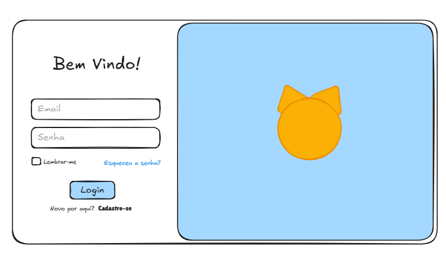

### Dashboard
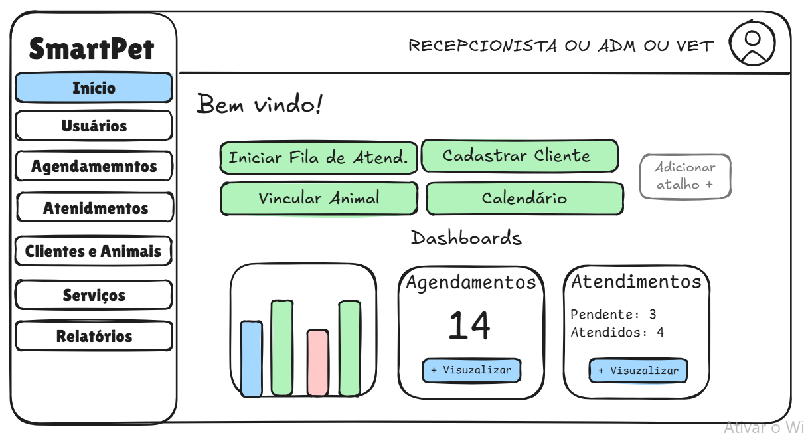

### CRUD dos Usuários
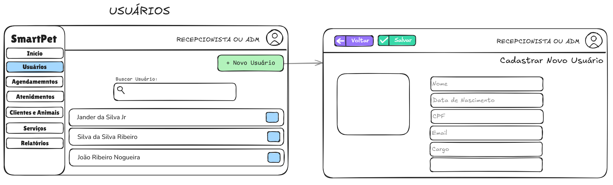

### Tela de Agendamento
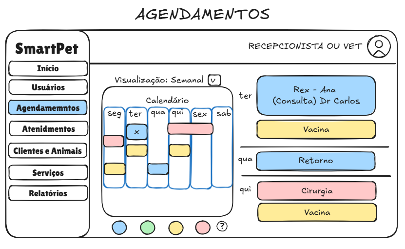

### Atendimentos (Recepcionista)
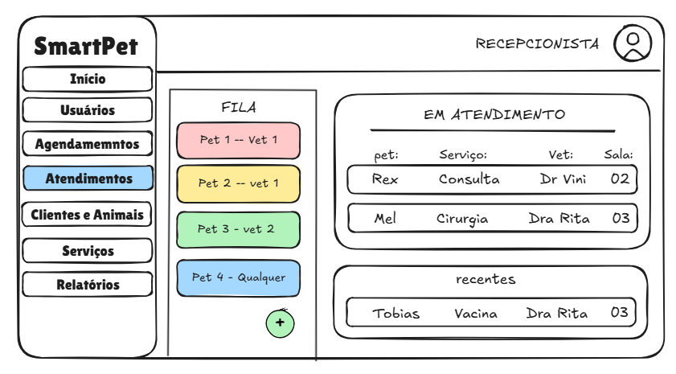

### Atendimentos (Veterinário)
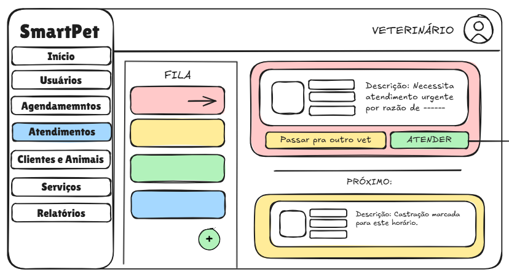
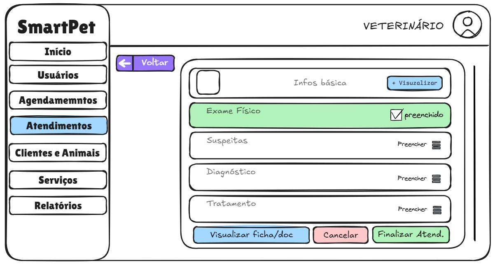

### CRUD de Clientes e Animais
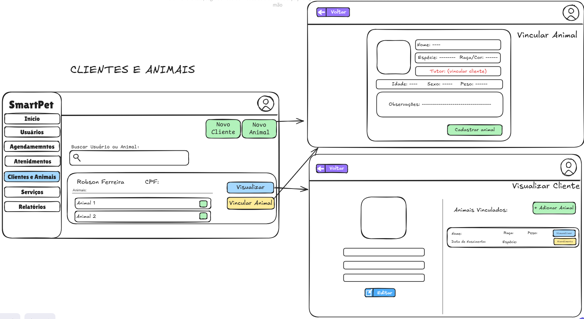

### CRUD de Serviços
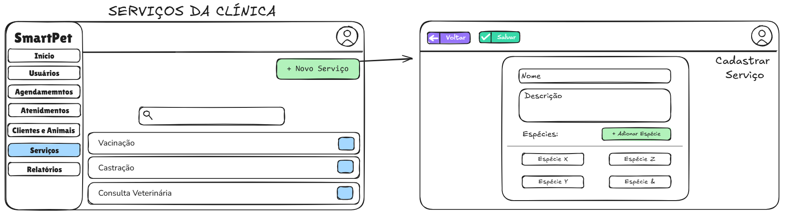

### Relatórios
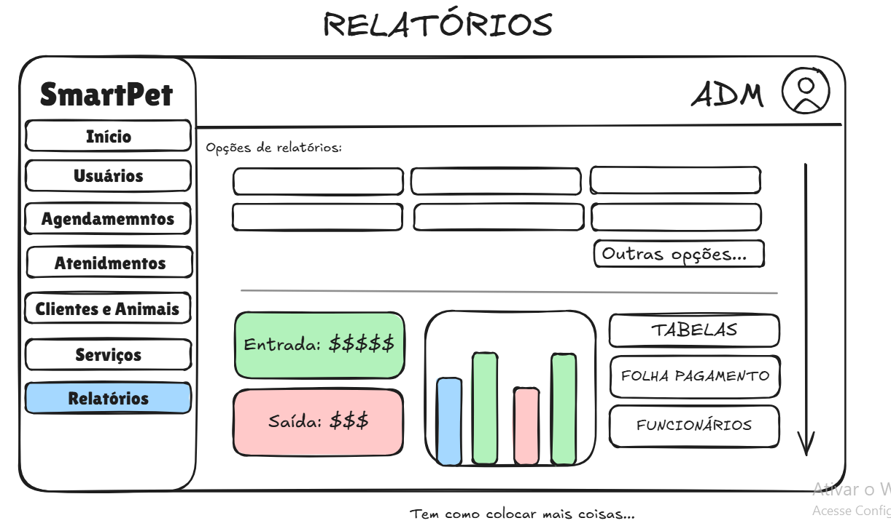

---

## Projeto
### Diagrama de Classes
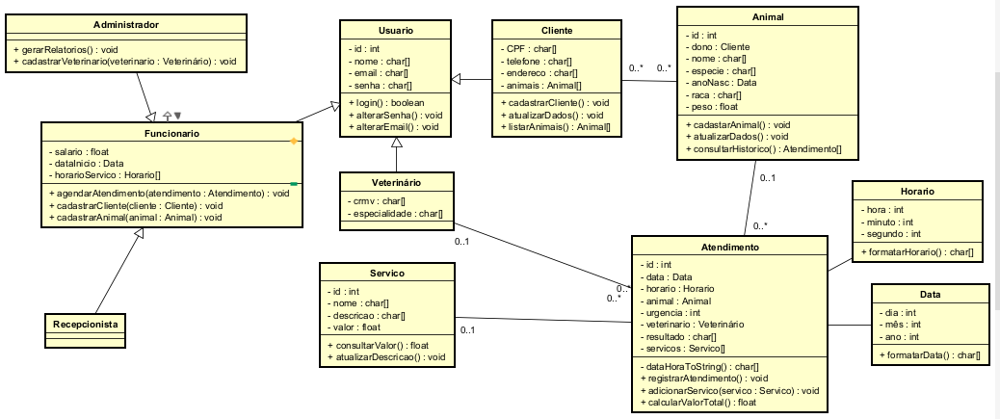

### Arquitetura
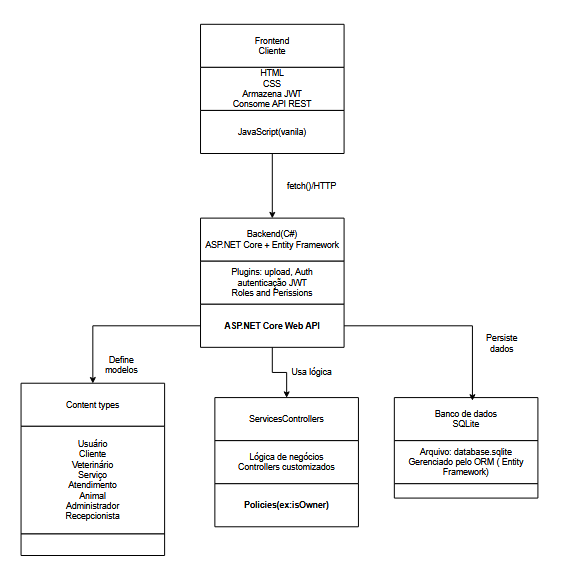

### Autenticação e Autorização
A autenticação e autorização no ASP.NET Core são implementadas com base em identidade de usuários (Identity), roles (funções/perfis) e claims (declarações personalizadas).

A arquitetura permite definir exatamente o que cada tipo de usuário pode ou não pode fazer ao interagir com os endpoints da API.

### Tipos de Usuários no Sistema:

#### Usuários Autenticados (Clientes, Veterinários, etc.)
- Criados via cadastro/login pela API pública.
- Associados a uma ou mais roles definidas no sistema (ex: Cliente, Veterinario).
- Acesso autenticado via token JWT, emitido após login.
- Suas permissões são controladas por atributos [Authorize(Roles = "NomeDaRole")] nos controllers.

#### Usuários Administrativos (Administrador, Recepcionista)
- Criados diretamente por administradores do sistema ou via scripts iniciais (seed).
- Possuem permissões elevadas para gerenciar usuários, dados e agendamentos.
- Também utilizam JWT para autenticação.
- Têm acesso a rotas protegidas por roles específicas como administrador ou recepcionista.

### Tecnologias a Serem Utilizadas
- ASP.NET Core – Para criação das rotas RESTful.
- Entity Framework Core – Para acesso e mapeamento de dados no banco relacional.
- JWT (JSON Web Token) – Para autenticação segura via token.
- ASP.NET Identity – Para gerenciamento de usuários, senhas, roles e autenticação.
- HTML, CSS – Para a interface do usuário.
- SQLite – Banco de dados leve utilizado durante o desenvolvimento.

---